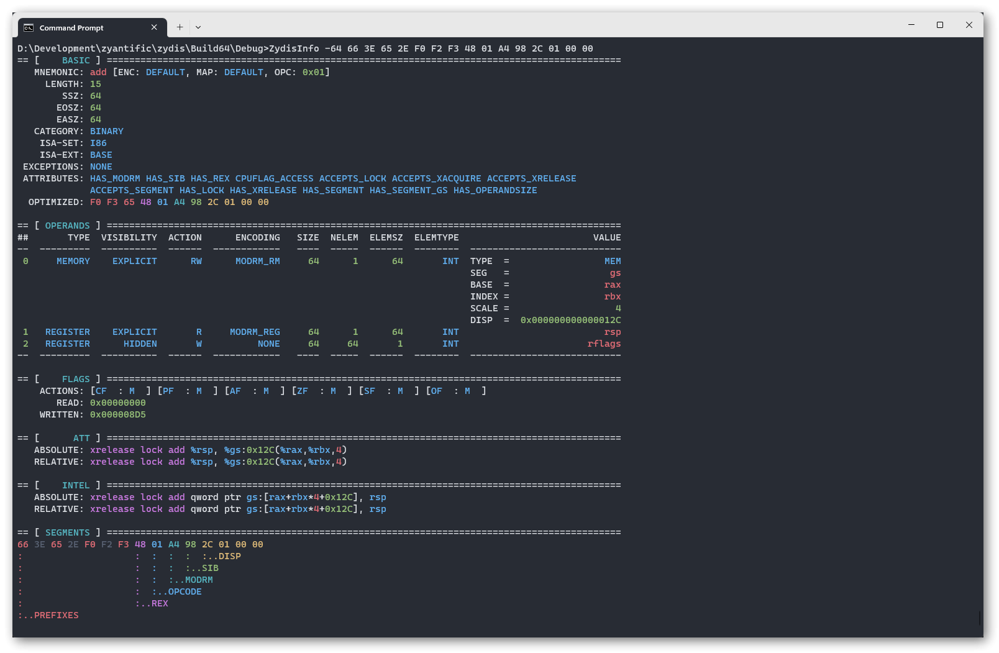

<p align="center">
  
</p>

<p align="center">
  
  <a href="https://github.com/zyantific/zydis/actions"></a>
  <a href="https://bugs.chromium.org/p/oss-fuzz/issues/list?sort=-opened&can=1&q=proj:zydis"></a>
  <a href="https://gitter.im/zyantific/zydis?utm_source=badge&utm_medium=badge&utm_campaign=pr-badge&utm_content=body_badge"></a>
  <a href="https://discord.zyantific.com/"></a>
</p>

<p align="center">Fast and lightweight x86/x86-64 disassembler and code generation library.</p>

## Features

- Supports all x86 and x86-64 (AMD64) instructions and [extensions](./include/Zydis/Generated/EnumISAExt.h)
- Optimized for high performance
- No dynamic memory allocation ("malloc")
- Thread-safe by design
- Very small file-size overhead compared to other common disassembler libraries
- [Complete doxygen documentation](https://zydis.re/doc/3/)
- Absolutely no third party dependencies — not even libc
  - Should compile on any platform with a working C11 compiler
  - Tested on Windows, macOS, FreeBSD, Linux and UEFI, both user and kernel mode

## Decoder Example

The following example program uses Zydis to disassemble a given memory buffer and prints the output to the console ([more examples here](./examples/)).

https://github.com/zyantific/zydis/blob/9cb54996c215422a398d7d2a287a08a185344200/examples/Disassemble.c#L27-L75

The above example program generates the following output:

```asm
007FFFFFFF400000   push rcx
007FFFFFFF400001   lea eax, [rbp-0x01]
007FFFFFFF400004   push rax
007FFFFFFF400005   push qword ptr [rbp+0x0C]
007FFFFFFF400008   push qword ptr [rbp+0x08]
007FFFFFFF40000B   call [0x008000007588A5B1]
007FFFFFFF400011   test eax, eax
007FFFFFFF400013   js 0x007FFFFFFF42DB15
```

## Encoder Example

https://github.com/zyantific/zydis/blob/b37076e69f5aa149fde540cae43c50f15a380dfc/examples/EncodeMov.c#L32-L66

The above example program generates the following output:

```
48 C7 C0 37 13 00 00
```

## Build

### Unix

Zydis builds cleanly on most platforms without any external dependencies. You can use CMake to generate project files for your favorite C11 compiler.

```bash
git clone --recursive 'https://github.com/zyantific/zydis.git'
cd zydis
mkdir build && cd build
cmake ..
make
```

### Windows

Either use the [Visual Studio 2019 project](./msvc/) or build Zydis using [CMake](https://cmake.org/download/) ([video guide](https://www.youtube.com/watch?v=fywLDK1OAtQ)).

#### Building Zydis - Using vcpkg

You can download and install Zydis using the [vcpkg](https://github.com/Microsoft/vcpkg) dependency manager:

```bash
git clone https://github.com/Microsoft/vcpkg.git
cd vcpkg
./bootstrap-vcpkg.sh
./vcpkg integrate install
./vcpkg install zydis
```
The Zydis port in vcpkg is kept up to date by Microsoft team members and community contributors. If the version is out of date, please [create an issue or pull request](https://github.com/Microsoft/vcpkg) on the vcpkg repository.

## Using Zydis in a CMake project

An example on how to use Zydis in your own CMake based project [can be found in this repo](https://github.com/zyantific/zydis-submodule-example).

## ZydisInfo tool



## Bindings

Official bindings exist for a selection of languages:

- [Pascal](https://github.com/zyantific/zydis-pascal)
- [Python 3](https://github.com/zyantific/zydis-py)
- [Rust](https://github.com/zyantific/zydis-rs)

Unofficial but actively maintained bindings:

- [Go](https://github.com/jpap/go-zydis)
- [Haskell](https://github.com/nerded1337/zydiskell)

## asmjit-style C++ front-end

If you're looking for an asmjit-style assembler front-end for the encoder, check out [zasm](https://github.com/zyantific/zasm)!

## Versions

### Scheme

Versions follow the [semantic versioning scheme](https://semver.org/). All stability guarantees apply to the API only — ABI stability between patches cannot be assumed unless explicitly mentioned in the release notes.

### Branches & Tags

- `master` holds the bleeding edge code of the next, unreleased Zydis version. Elevated amounts of bugs and issues must be expected, API stability is not guaranteed outside of tagged commits.
- Stable and preview versions are annotated with git tags
  - beta and other preview versions have `-beta`, `-rc`, etc. suffixes
- `maintenance/v2` contains the code of the latest legacy release of v2
  - v2 is now deprecated, but will receive security fixes until 2021

## Credits

- Intel (for open-sourcing [XED](https://github.com/intelxed/xed), allowing for automatic comparison of our tables against theirs, improving both)
- [LLVM](https://llvm.org) (for providing pretty solid instruction data as well)
- Christian Ludloff (http://sandpile.org, insanely helpful)
- [LekoArts](https://www.lekoarts.de/) (for creating the project logo)
- Our [contributors on GitHub](https://github.com/zyantific/zydis/graphs/contributors)

## Troubleshooting

### `-fPIC` for shared library builds

```
/usr/bin/ld: ./libfoo.a(foo.c.o): relocation R_X86_64_PC32 against symbol `bar' can not be used when making a shared object; recompile with -fPIC
```

Under some circumstances (e.g. when building Zydis as a static library using
CMake and then using Makefiles to manually link it into a shared library), CMake
might fail to detect that relocation information must be emitted. This can be forced
by passing `-DCMAKE_POSITION_INDEPENDENT_CODE=ON` to the CMake invocation.

## Consulting and Business Support

We offer consulting services and professional business support for Zydis. If you need a custom extension, require help in integrating Zydis into your product or simply want contractually guaranteed updates and turnaround times, we are happy to assist with that! Please contact us at business@zyantific.com.

## Donations

Since GitHub Sponsors currently doesn't support sponsoring teams directly, donations are collected and distributed using [flobernd](https://github.com/users/flobernd/sponsorship)s account.

## License

Zydis is licensed under the MIT license.
